# 🍛 Foodle — Production Multi-Role Food Delivery Platform

[](https://foodle-xi-lime.vercel.app)
[](https://github.com/MrAKM123/foodle)

[](https://github.com/MrAKM123/foodle/actions)
[](https://www.typescriptlang.org/)
[](https://reactjs.org/)
[](https://nodejs.org/)
[](https://www.prisma.io/)
[](https://neon.tech/)
[](https://tailwindcss.com/)
[](https://opensource.org/licenses/MIT)

> 🌐 **Live Web Application**: **[https://foodle-xi-lime.vercel.app](https://foodle-xi-lime.vercel.app)**
> 
> **Foodle** is a full-stack, real-time multi-role food ordering and delivery platform (inspired by Swiggy/Zomato), engineered with TypeScript, React, Node.js, Express, PostgreSQL (Neon), Prisma ORM, Socket.io, Leaflet OSM, and Razorpay Test Mode. Deployed 100% on free-tier cloud infrastructure (Vercel + Render + Neon).

---

## ⚡ 1-Click Demo Accounts

Try any role immediately using the **Floating Demo Switcher** pinned to the bottom-right corner of the web app, or sign in manually with these pre-seeded credentials:

| Role | Portal Path | Email | Password | Primary Capabilities |
| :--- | :--- | :--- | :--- | :--- |
| **Customer** | `/app` | `customer@foodle.app` | `Demo123!` | Browse menus, filters, customizable cart, Razorpay/COD checkout, live GPS tracking, Delivery OTP |
| **Restaurant Partner** | `/restaurant` | `partner@foodle.app` | `Demo123!` | Live kitchen queue, audio chime, prep time, order state advances, catalog editor, earnings ledger |
| **Delivery Rider** | `/rider` | `rider@foodle.app` | `Demo123!` | Duty toggle, 30s dispatch popups, route maps, trip stepper, 4-digit Delivery OTP handshake, wallet |
| **Super Admin** | `/admin` | `admin@foodle.app` | `Demo123!` | Platform telemetry, kitchen onboarding, rider KYC verification, force cancellation, coupons, ledger |

---

## 📸 Screenshots Showcase

| 🍛 Customer Discovery & Dishes | 🛒 Cart, Coupons & Checkout | 🛵 Live GPS Tracking & OTP |
| :---: | :---: | :---: |
| 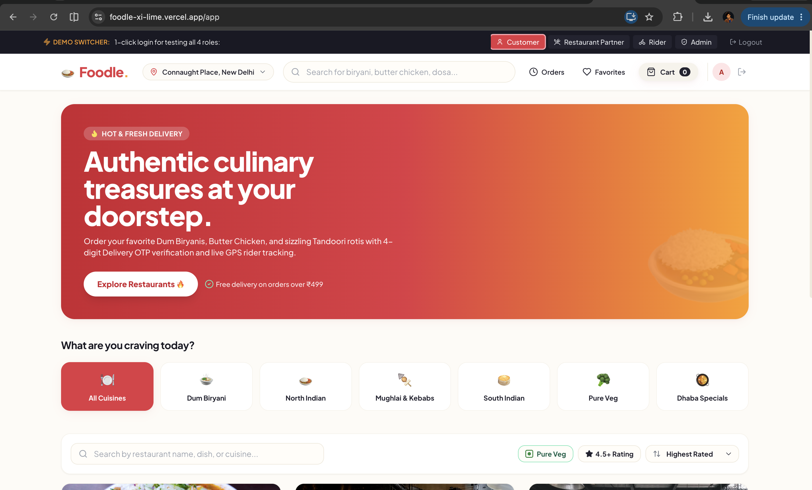 | 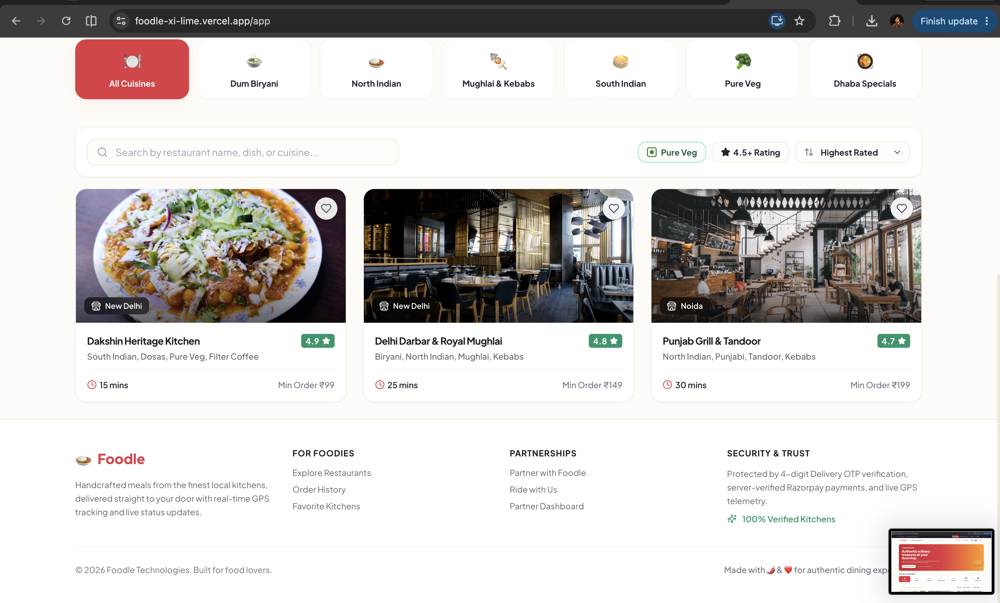 | 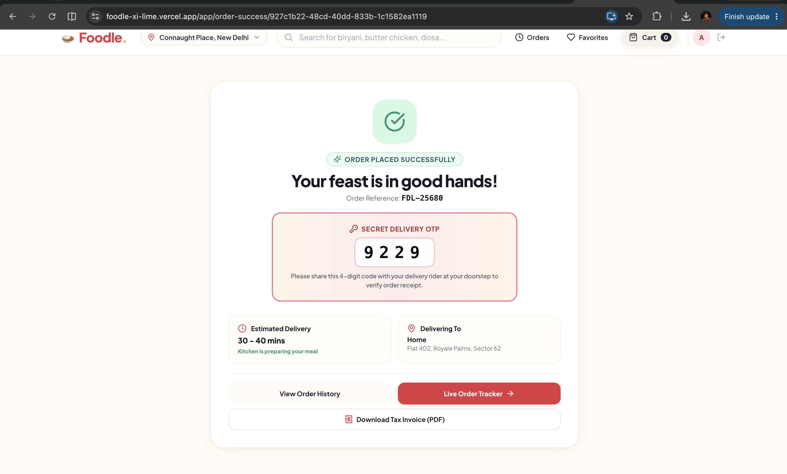 |

| 👨‍🍳 Kitchen Partner Live Queue | 📋 Menu & Catalog Editor | 💳 Rider Hero App & Wallet |
| :---: | :---: | :---: |
| 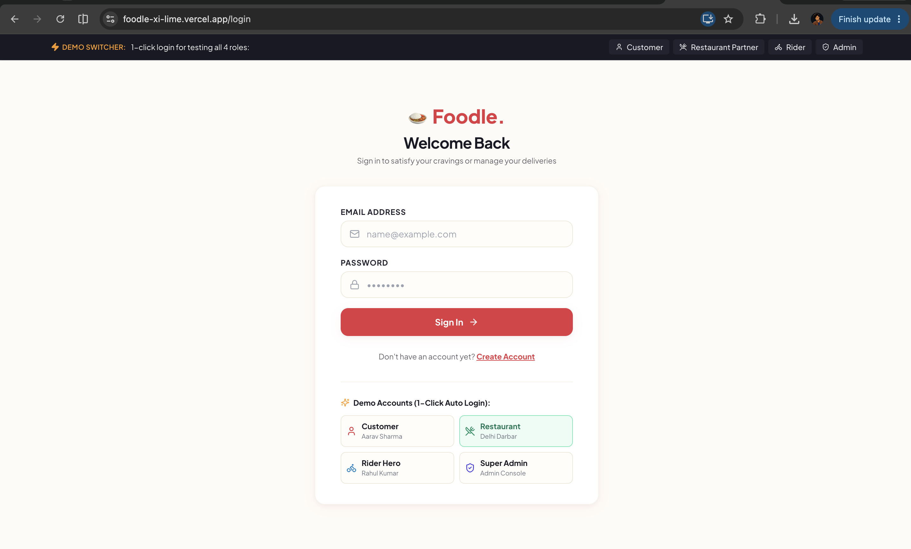 | 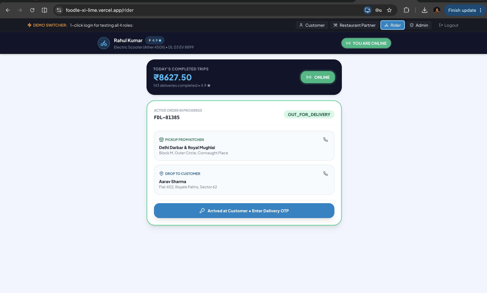 | 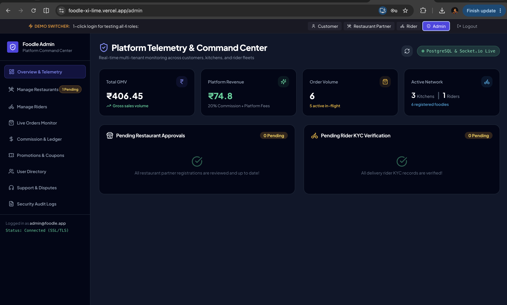 |

| 💰 Rider Earnings Wallet | ⚡ Super Admin Command Center | 🛍️ Customizable Dishes |
| :---: | :---: | :---: |
| 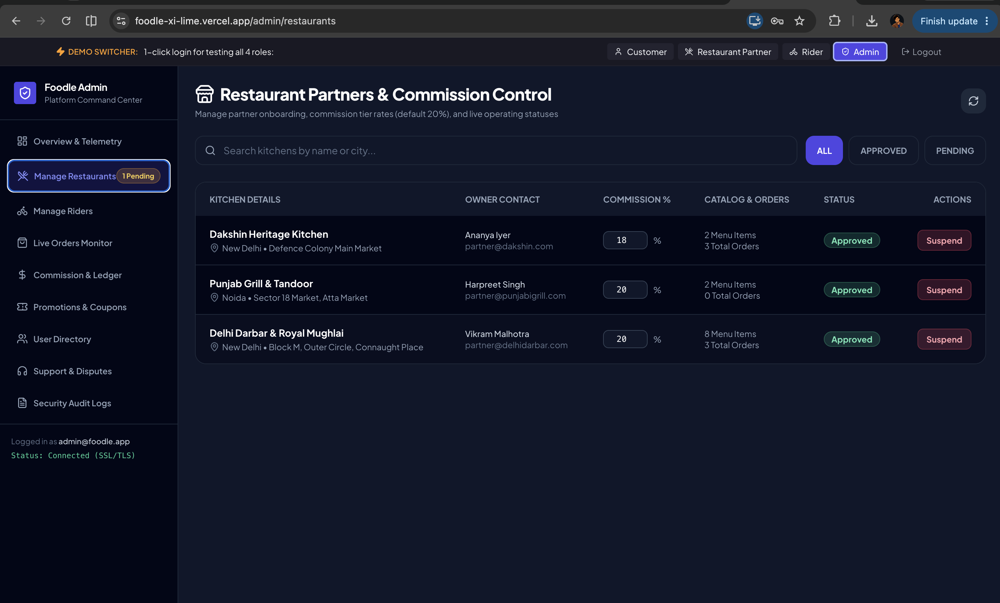 | 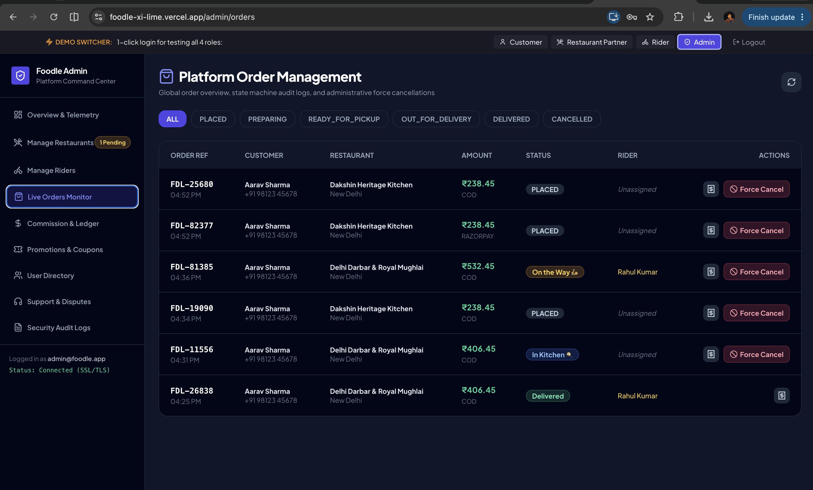 | 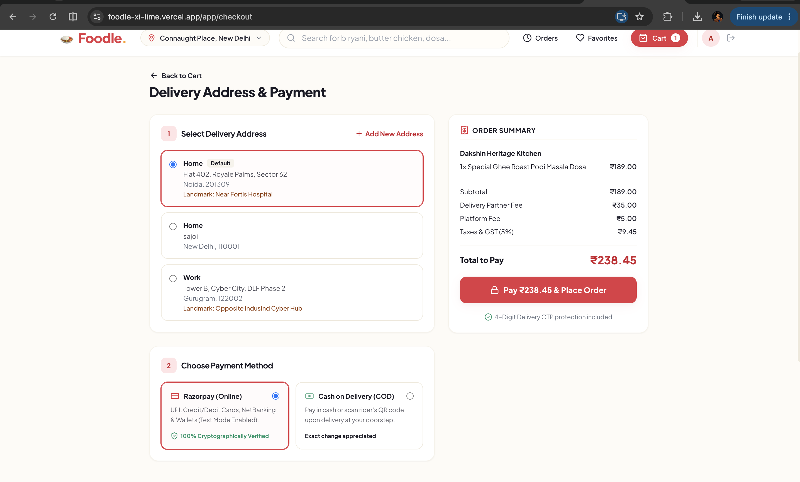 |

---

## 🏗️ System Architecture

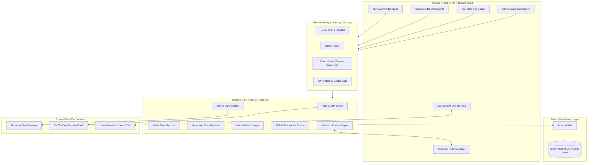

---

## 🔄 Order Lifecycle State Machine

Only mathematically valid state transitions are allowed by the backend state validator:

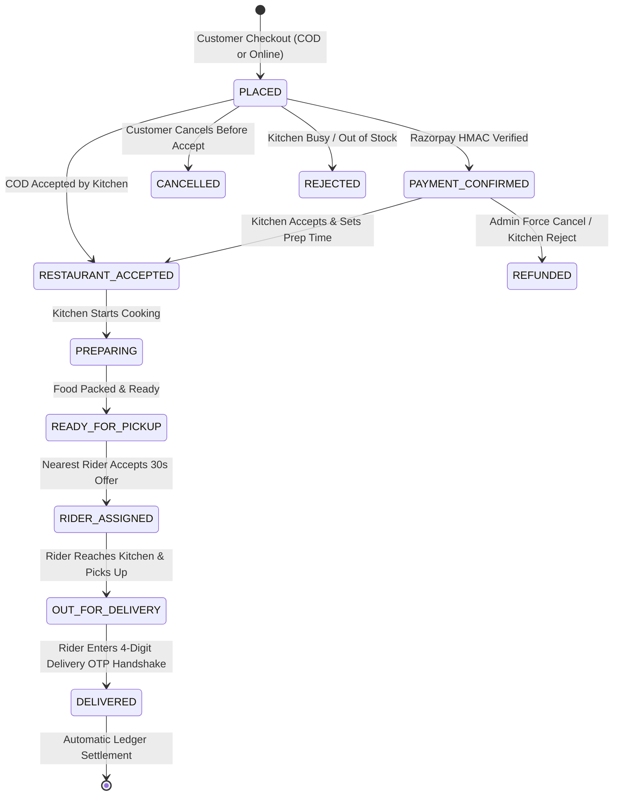

---

## 💰 Double-Entry Financial Ledger & Commission Model

Every completed order executes a multi-table database transaction that records double-entry bookkeeping:

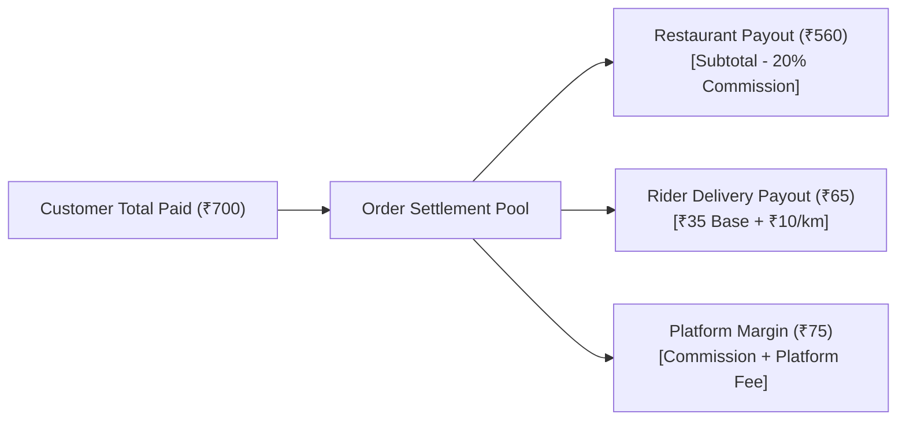

---

## 📱 Role Breakdown & Key Features

### 1. Customer (`/app`)
- **Smart Discovery**: Live search, Pure Veg toggle, 4.5+ star rating filter, cuisine tags, and sorting by ETA or Price.
- **Interactive Catalog**: Dish cards with dietary markers (🟢 Veg / 🔴 Non-Veg), spice meter, portion variants (Half/Full), and customizable add-ons.
- **Single-Restaurant Cart**: Clear replace-cart confirmation modal with item counts and real-time total bill math.
- **Checkout & Test Payments**: Saved address selector, coupon code voucher applicator, bill breakdown (Item Total, 5% GST, ₹5 Platform Fee, Delivery Fee), and Razorpay Sandbox or Cash on Delivery.
- **Live GPS Order Tracker**: Dynamic Leaflet OSM map with animated rider marker, trip ETA countdown, and **secret 4-digit Delivery OTP**.
- **1-Click PDF Tax Invoice**: Downloadable computer-generated tax receipts generated via `pdfkit`.

### 2. Restaurant Kitchen Partner (`/restaurant`)
- **Live Kitchen Queue**: Real-time incoming orders board with Web Audio sound alert chimes.
- **Order Flow Control**: Accept/Reject, set preparation ETA (e.g. 20 mins), "Start Preparing", and "Ready for Pickup".
- **Menu Catalog Manager**: Instant toggle for in-stock / out-of-stock items, price updater, and add-on modifiers.
- **Partner Earnings Ledger**: Line-item breakdown of gross food sales, 20% platform commission deduction, and net bank payout balance.

### 3. Delivery Rider Hero (`/rider`)
- **Duty Controller**: Instant Online/Offline duty toggle with GPS heartbeat.
- **Proximity Offer Dispatch**: 30-second countdown acceptance popups with pickup address, drop distance, and estimated earning.
- **Live Trip Stepper**: "Accepted" ➡️ "Reached Kitchen" ➡️ "Picked Up" ➡️ "Reached Customer".
- **Cryptographic Delivery Handshake**: Secure modal requiring the customer's 4-digit Delivery OTP to complete delivery (enforcing 3-attempt brute-force limit).
- **Rider Wallet**: Lifetime delivery counts, distance bonus statements, and instant bank transfer withdrawal simulations.

### 4. Super Admin Command Center (`/admin`)
- **Real-Time Telemetry**: Live metrics for GMV, Platform Commissions, Order Volume, Active Kitchens, and Online Fleet.
- **Partner Moderation**: Review and approve newly registered restaurants; customize individual commission rates (default 20%).
- **Rider KYC Verification**: Validate driving licenses, vehicle registrations, and account clearances.
- **Order Intervention**: Global order audit trail with emergency force cancellation and refund trigger.
- **Promo Coupon Engine**: Create percentage or flat vouchers, minimum spend limits, max discount caps, and expiry dates.
- **Financial Reconciliation**: Super admin settlement journal with 1-click batch payout execution.

---

## 🛡️ Security & Hardening (`SECURITY.md`)

- **Zero Hardcoded Secrets**: All keys, secrets, and database credentials are read from `.env` files.
- **Password Security**: Passwords salted and hashed with `bcryptjs`.
- **Session Security**: JWT access tokens stored in `httpOnly`, `secure`, `sameSite: strict` cookies.
- **Cryptographic Signatures**: Razorpay payment verification uses HMAC-SHA256 signature calculation.
- **Rate Limiting**: Express-rate-limit configured with strict thresholds on authentication, OTP generation, and order creation.
- **SQL & Query Safety**: All database interactions execute via parameterized queries in Prisma ORM.

---

## 🛠️ Tech Stack

| Layer | Technologies |
| :--- | :--- |
| **Frontend** | React 18, Vite, React Router v6, Tailwind CSS, Lucide Icons, React Hot Toast |
| **Backend** | Node.js, Express, TypeScript, Zod, Socket.io, PDFKit, Helmet, Morgan |
| **Database** | PostgreSQL (Neon / Supabase), SQLite (Local Dev fallback), Prisma ORM |
| **Realtime & Maps** | Socket.io WebSockets, Leaflet, OpenStreetMap Carto Tiles |
| **Payments & Auth** | Razorpay Test API, Bcrypt, JWT, Nodemailer |
| **Testing & CI** | Vitest (33 unit & integration tests), GitHub Actions CI |

---

## 🚀 Local Setup Instructions

### Prerequisites
- Node.js `>= 18.0.0`
- npm `>= 9.0.0`

### 1. Clone & Install Dependencies
```bash
git clone https://github.com/your-username/foodle.git
cd foodle

# Install server & client packages
npm --prefix server install
npm --prefix client install
```

### 2. Setup Environment Variables
Create `.env` in both `/server` and `/client` from their provided `.env.example` templates:

**Server Environment (`server/.env`):**
```env
PORT=5001
NODE_ENV=development
CLIENT_URL=http://localhost:5173
DATABASE_URL="file:./dev.db"
JWT_SECRET=super_secret_jwt_key_foodle_2026
JWT_REFRESH_SECRET=super_secret_refresh_key_foodle_2026
RAZORPAY_KEY_ID=rzp_test_mock_foodle
RAZORPAY_KEY_SECRET=mock_secret_foodle
```

**Client Environment (`client/.env`):**
```env
VITE_API_URL=http://localhost:5001/api
VITE_RAZORPAY_KEY_ID=rzp_test_mock_foodle
```

### 3. Initialize Database & Seed Demo Data
```bash
# Push schema to SQLite local database
npm --prefix server run prisma:push

# Seed authentic Indian restaurants, dishes, demo users, and coupons
npm --prefix server run seed
```

### 4. Run Test Suite
```bash
npm --prefix server test
```

### 5. Start Development Servers
```bash
# Start backend server (port 5001)
npm --prefix server run dev

# Start frontend client in another terminal (port 5173)
npm --prefix client run dev
```

Open [http://localhost:5173](http://localhost:5173) in your browser!

---

## 🌐 Production Deployment Guide (Free Tier)

### Step 1: Deploy Database on Neon (Free Tier)
1. Create a free account at [Neon.tech](https://neon.tech).
2. Create a new PostgreSQL database and copy the **Connection String** (`postgres://...`).
3. Set `DATABASE_URL` in your server environment to the Neon connection string.

### Step 2: Deploy Backend on Render (Free Tier Web Service)
1. Create a new **Web Service** on [Render.com](https://render.com) connected to your GitHub repository.
2. Root Directory: `server`
3. Build Command: `npm install && npx prisma generate --schema=prisma/schema.postgresql.prisma && npm run build`
4. Start Command: `node dist/server.js`
5. Set Environment Variables:
   - `NODE_ENV`: `production`
   - `PORT`: `10000`
   - `DATABASE_URL`: `your_neon_postgres_url`
   - `CLIENT_URL`: `https://your-app.vercel.app`
   - `JWT_SECRET`: `secure_production_random_secret`
   - `RAZORPAY_KEY_ID`: `your_razorpay_key`
   - `RAZORPAY_KEY_SECRET`: `your_razorpay_secret`

### Step 3: Deploy Frontend on Vercel (Free Tier)
1. Import your GitHub repository in [Vercel](https://vercel.com).
2. Root Directory: `client`
3. Framework Preset: `Vite`
4. Build Command: `npm run build`
5. Output Directory: `dist`
6. Set Environment Variables:
   - `VITE_API_URL`: `https://your-foodle-server.onrender.com/api`
   - `VITE_RAZORPAY_KEY_ID`: `your_razorpay_key_id`

## 👨‍💻 Author

**Akash Maurya**
- **GitHub**: [@MrAKM123](https://github.com/MrAKM123)
- **Live Project**: [https://foodle-xi-lime.vercel.app](https://foodle-xi-lime.vercel.app)

---

## 📜 License
This project is open-source and available under the [MIT License](LICENSE).
